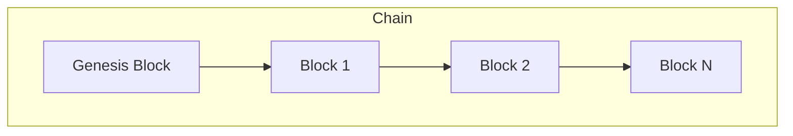

# Distributed Ledger (Rust)

A high-performance, immutable ledger implemented in Rust, focused on transaction integrity and auditing.

## 🏗️ Technical Overview
The ledger uses a Proof-of-Work (PoW) consensus mechanism to ensure data immutability.



## 💎 Features
- **Immutability**: SHA-256 hashing chain.
- **Consensus**: Tunable mining difficulty.
- **Safety**: Built with Rust's strict memory safety guarantees.

## 🚀 Build
```bash
cargo build --release
```